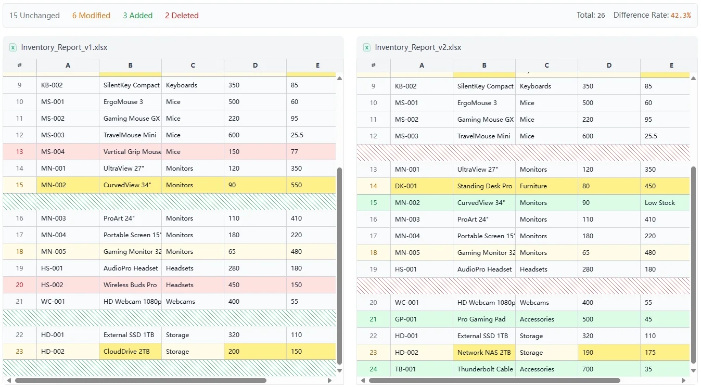
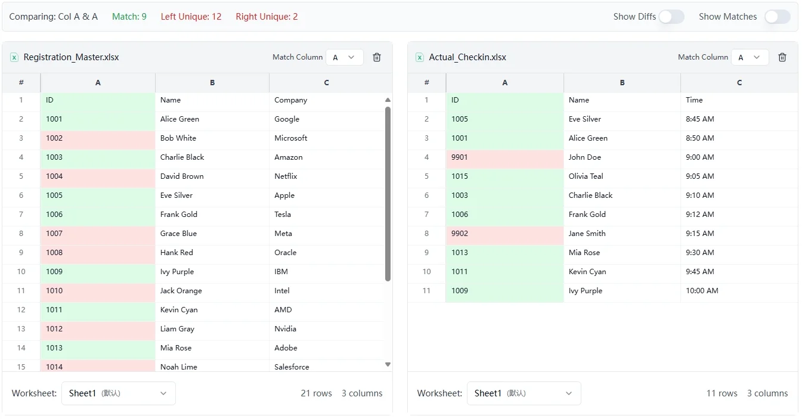
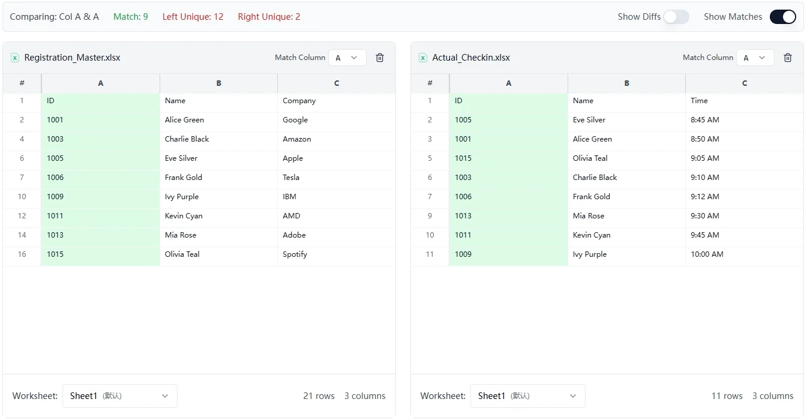
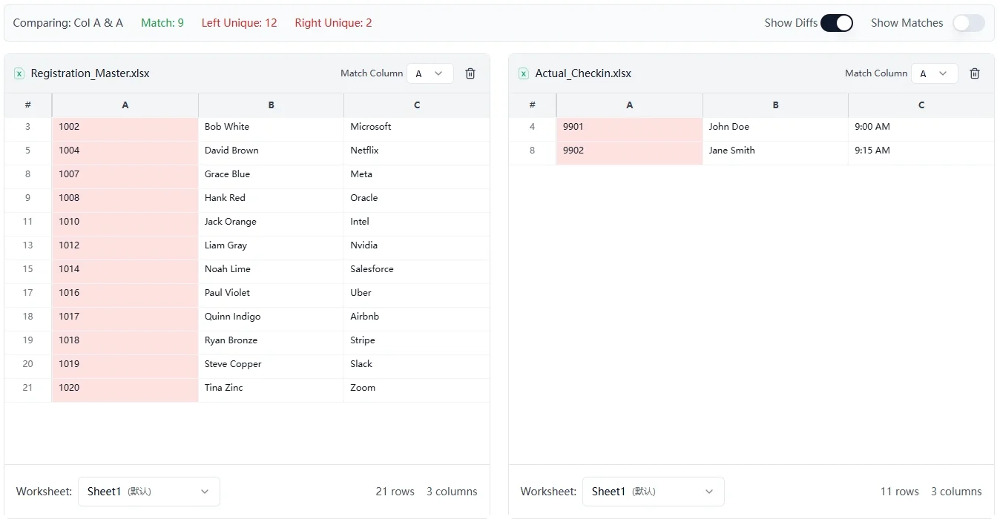

# Excel Compare

Stop messing with VLOOKUP formulas! [ExcelCompare](https://excelcompare.org) is a completely free online tool that helps you quickly find the differences between two Excel files.

## Key Features

### Dual File Comparison
*   Compare the complete content of two Excel files.
*   Independently switch between different worksheets on the left and right sides.
*   Automatically highlight added, deleted, and modified content.
*   Synchronous scrolling for easier comparison.

### Two Column Comparison
*   Quickly find duplicate data across two columns.
*   Highlight unique values that exist only in a specific column.
*   Statistics on the number of matches and differences.

### Smart Display
*   Color-coded changes: Green for additions, Red for deletions, Yellow for modifications.
*   Automatically hide identical rows so you can focus on the differences.
*   Expand to view full content whenever needed.

## Use Cases

### Finance
*   Compare financial statements between the current month and the previous month.
*   Reconcile budget versus actual spending.
*   Check for changes in accounts.

### Data Processing
*   Identify and clean up duplicate data.
*   Check data integrity.
*   Track what changes have been made to the data.

### Daily Office Work
*   Compare two versions of a client list.
*   Check for changes in inventory quantities.
*   Verify employee information updates.

## Why Use This?

| Feature | Excel Compare | Traditional Methods |
| :--- | :--- | :--- |
| **Cost** | Completely Free | Need to buy software |
| **Installation** | No installation required | Must install software |
| **Privacy** | Files stay on your computer | Data uploaded to cloud |
| **Operation** | Just drag and drop files | Complex formulas |
| **Speed** | Done in seconds | Takes a long time |

## Data Security

Your data security is our top priority:
*   All processing is done within your browser.
*   Files are never uploaded to any server.
*   We do not record or store any files.
*   Close the browser, and the data is gone.

## Supported Formats

*   **Excel Files:** .xlsx, .xls, .xlsm, .xlsb
*   **CSV Files:** .csv
*   **File Size:** Recommended under 50MB

## How to Use

### Compare Two Excel Files
1.  Open the [online excel compare tool](https://excelcompare.org)
2.  Drag the first file to the left area.
3.  Drag the second file to the right area.
4.  Select the worksheets you want to compare.
5.  Click "Start Compare".

### Compare Two Columns
1.  Go to the Two Column Comparison page.
2.  Upload your Excel file.
3.  Select the two columns you want to compare.
4.  See the results instantly.

## FAQ

**Q: Is this tool free?**
A: Completely free, with no paid features.

**Q: Will my files be uploaded to a server?**
A: No! All processing happens right in your own browser.

**Q: Which browsers are supported?**
A: Mainstream browsers like Chrome, Firefox, Safari, and Edge are all supported.

**Q: What is the file size limit?**
A: We recommend files under 50MB for the best performance.

**Q: Is the comparison accurate?**
A: We use professional difference algorithms, so the results are very reliable.

**Q: Do I need to install any software?**
A: No need to install anything, just use your browser.

## Tips

1.  **Focus on differences:** Use the fold/collapse feature to hide identical rows.
2.  **Adjust view:** Select 15/30/50 rows for the most comfortable view.
3.  **Multi-sheet comparison:** Quickly switch between different Sheets.
4.  **Save results:** Take a screenshot to save and share the results easily.

## Testimonials

> "No more writing VLOOKUPs! Monthly reconciliation went from two hours to five minutes." - *A Company Finance Manager*

> "I'm very reassured by the data security; we handle sensitive client information." - *Data Analyst*

> "The interface is clean and intuitive; our team's efficiency has improved a lot." - *Project Lead*

---

**Try it out**: [https://excelcompare.org](https://excelcompare.org)

If you have questions or suggestions, feel free to let us know on GitHub.
